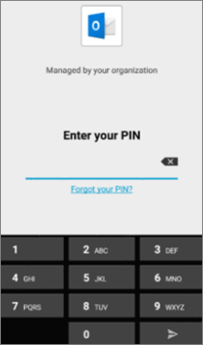

# Ověření nastavení ochrany aplikací na zařízeních se systémem Android nebo iOS

Podle pokynů v následujících částech ověřte nastavení ochrany aplikací na zařízeních se systémem Android nebo iOS.
  
## Android
  
### Kontrola, zda nastavení ochrany aplikací funguje na uživatelských zařízeních

Jakmile [nastavíte konfigurace aplikací pro zařízení s Androidem](app-protection-settings-for-android-and-ios.md), abyste chránili aplikace, můžete tímto postupem ověřit funkčnost zvoleného nastavení. 
  
Nejprve se ujistěte, že se zásady vztahují na aplikaci, ve které ji budete ověřovat.
  
1. V [Centru pro správu](https://portal.office.com)Microsoft 365 Business Premium přejděte na **zásady** \> **úpravy**zásad .
    
2. Zvolte **Zásady aplikace pro Android** pro nastavení, které jste vytvořili v nastavení, nebo jinou zásadu, kterou jste vytvořili, a ověřte, že je vynucená například pro Outlook. 
    
    
  
### Ověření nastavení Vyžadovat pro přístup k aplikacím Office PIN nebo otisk prstu

V podokně **Upravit zásadu** zvolte vedle **Řízení přístupu k dokumentům Office** možnost **Upravit**, rozbalte **Spravovat přístup uživatelů k souborům Office na mobilních zařízeních** a zkontrolujte, že volba **Vyžadovat pro přístup k aplikacím Office PIN nebo otisk prstu** je nastavena na **Zapnuto**.
  

  
1. V zařízení s Androidem uživatele otevřete Outlook a přihlaste se pomocí přihlašovacích údajů uživatele Microsoft 365 Business Premium.
    
2. Budete také vyzváni k zadání kódu PIN nebo použití otisku prstu.
    
    
  
### Ověření možnosti Resetovat PIN po několika neúspěšných pokusech

V podokně **Zásady úpravy** zvolte **Upravit** vedle **ovládacího prvku přístupu k dokumentům Office**, rozbalte možnost **Spravovat způsob, jakým uživatelé přistupují k souborům Office na mobilních zařízeních**, a ujistěte se, že je **resetovat PIN kód po počtu neúspěšných pokusů** nastavený na nějaký počet. Toje ve výchozím nastavení 5. 
  
1. V zařízení s Androidem uživatele otevřete Outlook a přihlaste se pomocí přihlašovacích údajů uživatele Microsoft 365 Business Premium.
    
2. Zadejte nesprávný PIN tolikrát, kolikrát to dovoluje nastavená zásada. Zobrazí se výzva, na které je uvedeno, že byl **dosaženo limitu pokusu o kód PIN** pro resetování kódu PIN. 
    
    
  
3. Stiskněte **Resetovat PIN kód**. Budete vyzváni k přihlášení pomocí přihlašovacích údajů uživatele Microsoft 365 Business Premium a potom budete muset nastavit nový KÓD PIN.
    
### Ověření možnosti Vynucovat, aby uživatelé ukládali všechny pracovní soubory na OneDrive pro firmy

V podokně **Upravit zásadu** zvolte vedle **Ochrana v případě ztráty nebo odcizení zařízení** možnost **Upravit**, rozbalte možnost **Chránit pracovní soubory při ztrátě nebo odcizení zařízení** a zkontrolujte, že je možnost **Vynucovat, aby uživatelé ukládali všechny pracovní soubory na OneDrive pro firmy** nastavená na **Zapnuto**.
  

  
1. V zařízení s Androidem uživatele otevřete Outlook a přihlaste se pomocí přihlašovacích údajů uživatele Microsoft 365 Business Premium a zadejte PIN kód na požádání.
    
2. Otevřete e-mail, který obsahuje přílohu, a vedle informací o příloze klepněte na ikonu se šipkou dolů.
    
    
  
    V dolní části obrazovky se zobrazí **možnost Nelze uložit do zařízení.** 
    
    
  
    > [!NOTE]
    > V této chvíli není v Androidu ukládání na OneDrive pro firmy povoleno, takže vidíte jen zablokované místní ukládání. 
  
### Ověření možnosti Vyžadovat, aby se uživatelé znovu přihlásili, pokud byly aplikace Office nečinné po dobu

V podokně **Zásady úpravy** zvolte **Upravit** vedle **ovládacího prvku přístupu k dokumentům Office**, rozbalte **možnost Spravovat způsob, jakým uživatelé přistupují k souborům Office na mobilních zařízeních**, a ujistěte se, že po nečinnosti aplikací Office bylo **nastaveno** na určitý počet minut. To je ve výchozím nastavení 30 minut. 
  
1. V zařízení s Androidem uživatele otevřete Outlook a přihlaste se pomocí přihlašovacích údajů uživatele Microsoft 365 Business Premium a zadejte PIN kód na požádání.
    
2. Měla by se zobrazit doručená pošta Outlooku. Nechte zařízení s Androidem nečinné aspoň 30 minut (nebo o něco déle, než jste zadali v zásadě). Obrazovka zařízení pravděpodobně ztmavne.
    
3. Znovu získejte přístup k Outlooku na zařízení s Androidem.
    
4. Než budete mít přístup k Outlooku, budete vyzváni k zadání kódu PIN.
    
### Ověření možnosti Chránit pracovní soubory šifrováním

V podokně **Upravit zásadu** zvolte vedle **Ochrana v případě ztráty nebo odcizení zařízení** možnost **Upravit**, rozbalte možnost **Chránit pracovní soubory při ztrátě nebo odcizení zařízení** a zkontrolujte, že **ochrana pracovních souborů šifrováním** je nastavená na **Zapnuto** a možnost **Vynucovat, aby uživatelé ukládali všechny pracovní soubory na OneDrive pro firmy** je nastavená na **Vypnuto**.
  
1. V zařízení s Androidem uživatele otevřete Outlook a přihlaste se pomocí přihlašovacích údajů uživatele Microsoft 365 Business Premium a zadejte PIN kód na požádání.
    
2. Otevřete e-mail, který obsahuje několik příloh souboru obrázků.
    
3. Klepnutím na ikonu šipky vedle informací o příloze soubory uložte.
    
    
  
4. Může se zobrazit výzva, abyste Outlooku na zařízení povolili přístup k fotkám, multimediálním a jiným souborům. Klepněte na **Povolit**.
    
5. Dole na obrazovce zvolte **Uložit do zařízení** a otevřete aplikaci **Galerie**. 
    
6. Šifrovaná fotka (nebo více fotek, pokud jste uložili více příloh obrázkových souborů) by měla být v seznamu. V seznamu obrázků by se měla zobrazit jako šedý čtvereček, který má uprostřed bílý vykřičník v kroužku.
    
    
  
## Ios
  
### Kontrola nastavení ochrany aplikací na zařízeních uživatelů

Jakmile [nastavíte konfigurace aplikací pro zařízení s iOSem](app-protection-settings-for-android-and-ios.md), abyste chránili aplikace, můžete tímto postupem ověřit funkčnost zvoleného nastavení. 
  
Nejprve se ujistěte, že se zásady vztahují na aplikaci, ve které ji budete ověřovat.
  
1. V [Centru pro správu](https://portal.office.com)Microsoft 365 Business Premium přejděte na **zásady** \> **úpravy**zásad .
    
2. Zvolte **Zásady aplikace pro iOS** pro nastavení, které jste vytvořili v nastavení, nebo pro jinou zásadu, kterou jste vytvořili, a ověřte, že je vynucená například pro Outlook. 
    
    
  
### Ověření možnosti Vyžadovat pro přístup k aplikacím Office PIN

V podokně **Upravit zásadu** zvolte vedle **Řízení přístupu k dokumentům Office** možnost **Upravit**, rozbalte **Spravovat přístup uživatelů k souborům Office na mobilních zařízeních** a zkontrolujte, že volba **Vyžadovat pro přístup k aplikacím Office PIN nebo otisk prstu** je nastavena na **Zapnuto**.
  

  
1. V zařízení s iOS uživateleotevřete Outlook a přihlaste se pomocí přihlašovacích údajů uživatele Microsoft 365 Business Premium.
    
2. Budete také vyzváni k zadání kódu PIN nebo použití otisku prstu.
    
    
  
### Ověření možnosti Resetovat PIN po několika neúspěšných pokusech

V podokně **Zásady úpravy** zvolte **Upravit** vedle **ovládacího prvku přístupu k dokumentům Office**, rozbalte možnost **Spravovat způsob, jakým uživatelé přistupují k souborům Office na mobilních zařízeních**, a ujistěte se, že je **resetovat PIN kód po počtu neúspěšných pokusů** nastavený na nějaký počet. Toje ve výchozím nastavení 5. 
  
1. V zařízení s iOS uživateleotevřete Outlook a přihlaste se pomocí přihlašovacích údajů uživatele Microsoft 365 Business Premium.
    
2. Zadejte nesprávný PIN tolikrát, kolikrát to dovoluje nastavená zásada. Zobrazí se výzva, na které je uvedeno, že byl **dosaženo limitu pokusu o kód PIN** pro resetování kódu PIN. 
    
    
  
3. Stiskněte **OK**. Budete vyzváni k přihlášení pomocí přihlašovacích údajů uživatele Microsoft 365 Business Premium a potom budete muset nastavit nový KÓD PIN.
    
### Ověření možnosti Vynucovat, aby uživatelé ukládali všechny pracovní soubory na OneDrive pro firmy

V podokně **Upravit zásadu** zvolte vedle **Ochrana v případě ztráty nebo odcizení zařízení** možnost **Upravit**, rozbalte možnost **Chránit pracovní soubory při ztrátě nebo odcizení zařízení** a zkontrolujte, že je možnost **Vynucovat, aby uživatelé ukládali všechny pracovní soubory na OneDrive pro firmy** nastavená na **Zapnuto**.
  

  
1. V zařízení s iOS uživatelem otevřete Outlook a přihlaste se pomocí přihlašovacích údajů uživatele Microsoft 365 Business Premium a zadejte PIN kód na požádání.
    
2. Otevřete e-mail, který obsahuje přílohu. Přílohu otevřete a ve spodní části obrazovky zvolte **Uložit**. 
    
    
  
3. Měla by se zobrazit jen možnost OneDrive pro firmy. Pokud ne, klepněte na **Přidat účet** a na obrazovce Přidat **účet úložiště** vyberte **OneDrive pro firmy.** Po zadání výzvy poskytněte koncovému uživateli Microsoft 365 Business Premium. 
    
    Klepněte na **Uložit** a vyberte **OneDrive pro firmy**.
    
### Ověření možnosti Vyžadovat, aby se uživatelé znovu přihlásili, pokud byly aplikace Office nečinné po dobu

V podokně **Zásady úpravy** zvolte **Upravit** vedle **ovládacího prvku přístupu k dokumentům Office**, rozbalte **možnost Spravovat způsob, jakým uživatelé přistupují k souborům Office na mobilních zařízeních**, a ujistěte se, že po nečinnosti aplikací Office bylo **nastaveno** na určitý počet minut. To je ve výchozím nastavení 30 minut. 
  
1. V zařízení s iOS uživatelem otevřete Outlook a přihlaste se pomocí přihlašovacích údajů uživatele Microsoft 365 Business Premium a zadejte PIN kód na požádání.
    
2. Měla by se zobrazit doručená pošta Outlooku. Nechte zařízení s iOSem nečinné alespoň 30 minut (nebo o něco déle, než jste zadali v zásadě). Obrazovka zařízení pravděpodobně ztmavne.
    
3. Znovu získejte přístup k Outlooku na iOS zařízení.
    
4. Než budete mít přístup k Outlooku, budete vyzváni k zadání kódu PIN.
    
### Ověření možnosti Chránit pracovní soubory šifrováním

V podokně **Upravit zásadu** zvolte vedle **Ochrana v případě ztráty nebo odcizení zařízení** možnost **Upravit**, rozbalte možnost **Chránit pracovní soubory při ztrátě nebo odcizení zařízení** a zkontrolujte, že **ochrana pracovních souborů šifrováním** je nastavená na **Zapnuto** a možnost **Vynucovat, aby uživatelé ukládali všechny pracovní soubory na OneDrive pro firmy** je nastavená na **Vypnuto**.
  
1. V zařízení s iOS uživatelem otevřete Outlook a přihlaste se pomocí přihlašovacích údajů uživatele Microsoft 365 Business Premium a zadejte PIN kód na požádání.
    
2. Otevřete e-mail, který obsahuje několik příloh souboru obrázků.
    
3. Klepněte na přílohu a potom klepněte níže na možnost **Uložit**. 
    
4. Na domovské obrazovce otevřete aplikaci **Fotky**. Šifrovaná fotka (nebo více fotek, pokud jste uložili více příloh obrázkových souborů) by měla uložená, ale zašifrovaná. 
    
---

